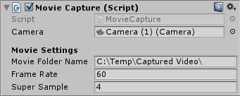

# Movie/Video Capture for Unity

This is the basic implementation of a movie capture script for Unity3d. Its purpose is to generate high resolution & detail video of scripted scenes regardless of hardware specs, by capturing super sampled screenshots. 

## Usage

* Attach the `MovieCapture.cs` to an empty game object, and set the target file folder & desired framerate. 
* Set the Editor Window resolution and super sampling rate accordingly. 
* * For Instance, if the desired output is 2560x1440, you can set the Editor Window resolution to 640x360 and the Super Sampling multiplier to 4, or to 1280x720 and 2 respectively.
* Press Play
* After completion, stop execution and use any software of your choice to generate a video file from the captured screenshots.

Note that this script is only suitable for capturing scripted sequences, and not actual gameplay. Depending on your settings and hardware specifications, a few minutes long sequence could take even hours to capture.

## Disclaimer

As this is only an initial implementation, lacking optimization, proper code documentation, error checking and more advanced options. 